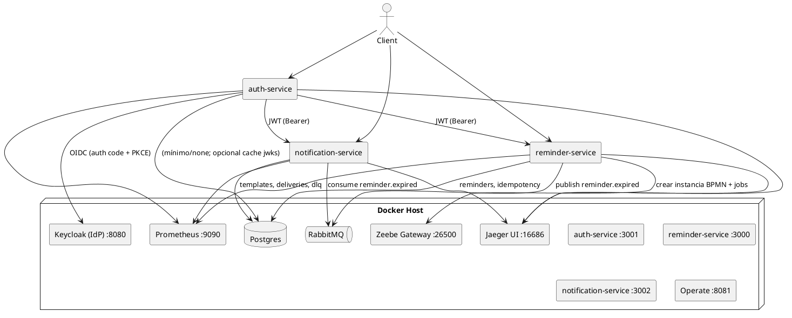
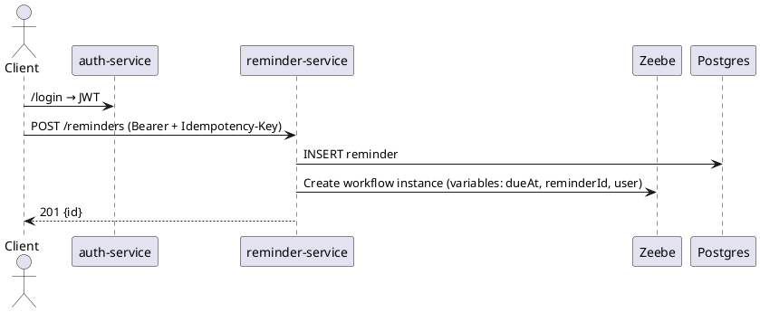

# SPEC-1—Plataforma SOA Node.js + TypeScript para Asistente Estudiantil (Auth, Reminder, Notification)

## Background

Se requiere un boilerplate reproducible de arquitectura SOA en Node.js + TypeScript para un asistente académico que orquesta autenticación (Auth/SSO), recordatorios con temporizadores (Reminder) y notificaciones push (Notification). El proyecto debe ser apto para desarrollo local y CI/CD, con servicios desacoplados, contratos OpenAPI, observabilidad básica y mensajería basada en eventos.

El contexto incluye integración con IdP institucional vía OAuth2/OIDC, sincronización de calendario institucional, y una ruta de evolución hacia recomendaciones con IA usando MCP como fuente de verdad. Para el ejercicio académico, se implementarán versiones mínimas funcionales (MVP) que validen:

* Autenticación y refresco de tokens contra un IdP (simulable/local).
* CRUD de recordatorios y programación de jobs/temporizadores ~ Camunda 8 (Zeebe).
* Emisión de eventos de vencimiento hacia un broker (RabbitMQ) y consumo posterior para envíos push a FCM/APNs a través del servicio Notification.
* Infra compartida en Docker Compose: Postgres, RabbitMQ, Jaeger, Prometheus; health/readiness; Swagger UI por servicio; tests con Jest; ESLint/Prettier; GitHub Actions CI.

Las decisiones deberán favorecer simplicidad, reproducibilidad y claridad pedagógica, permitiendo a un equipo ejecutar `docker compose up -d --build` y obtener servicios levantados con documentación y pruebas básicas.

## Requirements

### Supuestos

* Proyecto académico, **simple**, **bajo costo** y **100% open-source**.
* Se usará **Keycloak** (Docker) como IdP OIDC local.
* Orquestación de timers con **Camunda 8 – Zeebe** self-hosted en Docker (Operate para inspección).
* Infra compartida por Docker Compose v2.
* Cada servicio con su propia DB lógica (un esquema por servicio en **Postgres** compartido para simplificar).

### MoSCoW

**Must**

1. **Servicios**: `auth-service` (3001), `reminder-service` (3000), `notification-service` (3002).
2. **Auth/SSO**: OAuth2/OIDC con Keycloak; endpoints `/login`, `/callback`, `/token/refresh`; validación de JWT en servicios downstream.
3. **Perfil mínimo**: claims estándar (`sub`, `email`, `role`) vía Id Token; endpoint `/me` en `auth-service` que proxy/valide token.
4. **Recordatorios**: CRUD (`/reminders`), programación de timers en Zeebe (workflow BPMN con temporizador) y publicación de evento de vencimiento a RabbitMQ.
5. **Notificaciones**: consumo de mensajes de RabbitMQ (`reminder.expired`), plantillado simple y envío a **FCM** (web/android). **APNs** queda simulado (mock).
6. **Observabilidad**: Jaeger (tracing con OpenTelemetry), Prometheus (métricas HTTP, proceso y custom), logs estructurados (pino/winston).
7. **Contratos**: `openapi.yaml` por servicio, expuesto en `/openapi.yaml` y Swagger UI en `/api-docs`.
8. **Operabilidad**: `/health` y `/ready` en cada servicio; manejo centralizado de errores.
9. **Calidad**: Jest + ts-jest + supertest (unit e integración básica), ESLint + Prettier, GitHub Actions CI (setup, install, lint, test, build).
10. **Infra**: Dockerfiles multi-stage por servicio; `docker compose up -d --build` levanta: servicios, Postgres, RabbitMQ, Jaeger, Prometheus, Keycloak, Zeebe+Operate.
11. **Idempotencia**: middleware en `reminder-service` usando `Idempotency-Key` + tabla de llaves.

**Should**

1. **Rate limiting** liviano con `express-rate-limit` en endpoints públicos.
2. **Retries** y DLQ en RabbitMQ para notificaciones fallidas.
3. **Seed**: `init.sql` por servicio con tablas mínimas y usuarios de prueba en Keycloak (realm export/import).
4. **Calendario (stub)**: endpoint de lectura/sync con SLA de ≤ 5 min (simulado con cron + cola o Zeebe timer recurrente).

**Could**

1. **Integración LMS** (Moodle/Canvas) vía adaptador ACL (skeleton + mock de endpoints).
2. **MCP Context** como microservicio liviano que exponga `/context` y guarde preferencias.
3. **Recomendaciones IA** (placeholder) consumiendo MCP como fuente de verdad.

**Won’t (MVP)**

1. Alta disponibilidad y multi-región.
2. Integración real con APNs (se mantiene mocked).
3. Políticas avanzadas de seguridad (OPA, mTLS); se limita a TLS en reverso si se desea y JWT validation.

### Puertos y Endpoints Clave

* `auth-service` (3001): `/health`, `/ready`, `/api-docs`, `/openapi.yaml`, `/login`, `/callback`, `/token/refresh`, `/me`.
* `reminder-service` (3000): `/health`, `/ready`, `/api-docs`, `/openapi.yaml`, `POST/GET/PUT/DELETE /reminders`, `POST /reminders/:id/schedule`.
* `notification-service` (3002): `/health`, `/ready`, `/api-docs`, `/openapi.yaml`, `/templates` (CRUD básico).
* Infra: Keycloak (8080), Postgres (5432), RabbitMQ (5672/15672), Jaeger UI (16686), Prometheus (9090), Zeebe Gateway (26500), Operate (8081).

### Criterios de aceptación (resumen)

* `docker compose up -d --build` desde `infrastructure/docker` levanta todo y `/health` responde OK.
* Swagger UI accesible en cada servicio (`/api-docs`).
* Crear un reminder programa un workflow en Zeebe y, al vencer, se publica `reminder.expired` a RabbitMQ; Notification consume y registra intento de envío a FCM (mockeable con clave opcional).
* CI ejecuta lint, tests y build en PR `feat/boilerplate`.

## Method

### Arquitectura General (SOA con mensajería y orquestación de timers)



**Tecnologías (todas OSS):** Express, TypeScript, `swagger-ui-express`, `jsonwebtoken` + `jwks-rsa`, `pino` o `winston`, `amqplib`, `@zeebe/community-node` (o `zeebe-node`), `prom-client`, OpenTelemetry SDK, Jest/ts-jest/supertest.

---

### Modelos de Datos (mínimos por servicio)

**reminder-service (Postgres, esquema `reminder`)**

```sql
CREATE SCHEMA IF NOT EXISTS reminder;

CREATE TABLE IF NOT EXISTS reminder.reminders (
  id UUID PRIMARY KEY,
  user_sub TEXT NOT NULL,
  title TEXT NOT NULL,
  description TEXT,
  due_at TIMESTAMPTZ NOT NULL,
  status TEXT NOT NULL DEFAULT 'scheduled', -- scheduled|sent|canceled
  created_at TIMESTAMPTZ NOT NULL DEFAULT now(),
  updated_at TIMESTAMPTZ NOT NULL DEFAULT now()
);

CREATE TABLE IF NOT EXISTS reminder.idempotency_keys (
  key TEXT PRIMARY KEY,
  request_hash TEXT NOT NULL,
  response_body JSONB NOT NULL,
  status_code INT NOT NULL,
  created_at TIMESTAMPTZ NOT NULL DEFAULT now(),
  expires_at TIMESTAMPTZ NOT NULL DEFAULT (now() + interval '24 hours')
);
```

**notification-service (Postgres, esquema `notification`)**

```sql
CREATE SCHEMA IF NOT EXISTS notification;

CREATE TABLE IF NOT EXISTS notification.templates (
  id UUID PRIMARY KEY,
  code TEXT UNIQUE NOT NULL, -- e.g., REMINDER_DUE
  title_template TEXT NOT NULL,
  body_template TEXT NOT NULL,
  created_at TIMESTAMPTZ NOT NULL DEFAULT now()
);

CREATE TABLE IF NOT EXISTS notification.deliveries (
  id UUID PRIMARY KEY,
  user_sub TEXT NOT NULL,
  template_code TEXT NOT NULL,
  payload JSONB NOT NULL,
  status TEXT NOT NULL DEFAULT 'pending', -- pending|sent|failed
  error TEXT,
  created_at TIMESTAMPTZ NOT NULL DEFAULT now(),
  updated_at TIMESTAMPTZ NOT NULL DEFAULT now()
);

CREATE TABLE IF NOT EXISTS notification.dlq (
  id UUID PRIMARY KEY,
  original_message JSONB NOT NULL,
  reason TEXT NOT NULL,
  created_at TIMESTAMPTZ NOT NULL DEFAULT now()
);
```

**auth-service**

* No persiste usuarios (delegado a Keycloak). Puede tener una tabla opcional `jwks_cache` si se desea cachear claves, pero **no es obligatorio**.

---

### Contratos y Endpoints (resumen)

Cada servicio expone:

* `GET /health` y `GET /ready`.
* `GET /api-docs` (Swagger UI) y `GET /openapi.yaml`.

**auth-service**

* `GET /login` → redirige a Keycloak (Auth Code + PKCE).
* `GET /callback` → intercambia code por tokens, set-cookie (httpOnly) **opcional** y devuelve tokens (para simpleza, body JSON en MVP).
* `POST /token/refresh` → usa refresh_token contra Keycloak.
* `GET /me` → valida JWT (via JWKS) y retorna claims: `{ sub, email, role }`.

**reminder-service** (protegido por JWT)

* `POST /reminders` (Idempotency-Key soportado) → crea reminder + instancia flujo Zeebe.
* `GET /reminders/:id` | `PUT /reminders/:id` | `DELETE /reminders/:id` (cancelación marca `status='canceled'` y cancela instancia si aplica).
* `POST /reminders/:id/schedule` → reprogamar.

**notification-service** (protegido por JWT para CRUD de templates)

* `GET/POST/PUT/DELETE /templates`.
* *Interno*: consumidor de cola `reminder.expired`.

Formato del evento RabbitMQ `reminder.expired`:

```json
{
  "event": "reminder.expired",
  "reminderId": "uuid",
  "user": { "sub": "...", "email": "..." },
  "title": "...",
  "dueAt": "2025-01-01T10:00:00Z"
}
```

---

### Flujos Principales (secuencias)

**Creación de reminder**



**Vencimiento → Notificación**

```plantuml
@startuml ReminderExpire
participant "Zeebe" as ZB
participant "reminder-service" as REM
queue "RabbitMQ" as MQ
participant "notification-service" as NOTIF
participant "Postgres" as PG

ZB -> REM : Job: PublishExpirationEvent(reminderId)
REM -> MQ : publish reminder.expired
NOTIF -> MQ : consume reminder.expired
NOTIF -> PG : INSERT deliveries (pending)
NOTIF -> FCM (mock) : send(payload)
NOTIF -> PG : UPDATE deliveries set status='sent' (o 'failed')
@enduml
```

**Workflow BPMN (Zeebe) – simplificado**

* **Start** → **Service Task: RegisterReminder** (no-op en MVP, ya creado por API) → **Intermediate Timer** `timer: date(dueAt)` → **Service Task: PublishExpirationEvent** → **End**.
* Implementado con **job workers** en `reminder-service` usando `type: publish-expiration`.

---

### Middleware y Políticas

**Idempotencia (reminder-service)**

1. Si viene header `Idempotency-Key`, calcular `request_hash` (método+path+body normalizado).
2. Buscar en `idempotency_keys`; si existe y no expiró → devolver `response_body` y `status_code` almacenados.
3. Si no existe, ejecutar handler; guardar respuesta serializada y status; retornar.

**Validación y errores**

* Validación con `zod` o `express-validator`; errores estandarizados `{ code, message, details }`.
* Logger estructurado por request (correlation id `x-request-id`).

**Seguridad**

* Validación JWT con `jwks-rsa` (descarga de JWKS de Keycloak, cache + rate limit).
* Scopes/roles mínimos: `student`, `admin` para endpoints de templates.

**Observabilidad**

* **Tracing**: OpenTelemetry Node SDK + OTLP → Jaeger.
* **Métricas**: `prom-client` con `/metrics` (Prometheus scrape).
* **Logs**: `pino` con nivel configurable por `LOG_LEVEL`.

---

### Monorepo y Scripts

Estructura (resumen):

```
raíz/
  README.md
  QUICKSTART.md
  package.json (scripts de monorepo)
  tsconfig.json
  .eslintrc.js
  infrastructure/
    docker/
      docker-compose.yml
      .env.example
  services/
    reminder-service/
      src/{app.ts,index.ts,routes/,controllers/,services/,repositories/,models/}
      openapi.yaml
      init.sql
      Dockerfile
      package.json
      tsconfig.json
      __tests__/
    auth-service/ (similar)
    notification-service/ (skeleton + consumer)
  docs/
  .github/workflows/ci.yml
```

Scripts raíz sugeridos:

* `install:all`, `build:all`, `test:all`, `lint:all`, `docker:up`, `docker:down`, `docker:logs`, `docker:clean`, `dev:auth`, `dev:reminder`, `dev:notification`.

---

### OpenAPI (plantilla mínima por servicio)

* Declarar `securitySchemes` OIDC/JWT.
* Esquemas: `Reminder`, `Template`, `Delivery`.
* Paths clave documentados; exponer `servers: [{ url: http://localhost:PORT }]`.

---

### Configuración por Variables de Entorno (por defecto mocks)

* `FCM_ENABLED=false` (si `true`, usar `FCM_SERVER_KEY`).
* `APNS_ENABLED=false` (mock).
* `RABBITMQ_URL=amqp://rabbitmq:5672`.
* `POSTGRES_URL=postgres://...` (cada servicio con su `search_path`).
* `KEYCLOAK_ISSUER`, `KEYCLOAK_CLIENT_ID`, `KEYCLOAK_CLIENT_SECRET` (para confidential; en académico puede ser public + PKCE).
* `ZEEBE_GATEWAY_ADDRESS=zeebe:26500`.
* `OTEL_EXPORTER_OTLP_ENDPOINT=http://jaeger:4317` (o collector si se agrega).

```


## Implementation

_(Se detallará plan de implementación por milestones y scripts.)_

## Milestones

_(Se definirá tras acordar el método y alcance de MVP.)_

## Gathering Results

_(Criterios de aceptación y métricas post.)_


```
